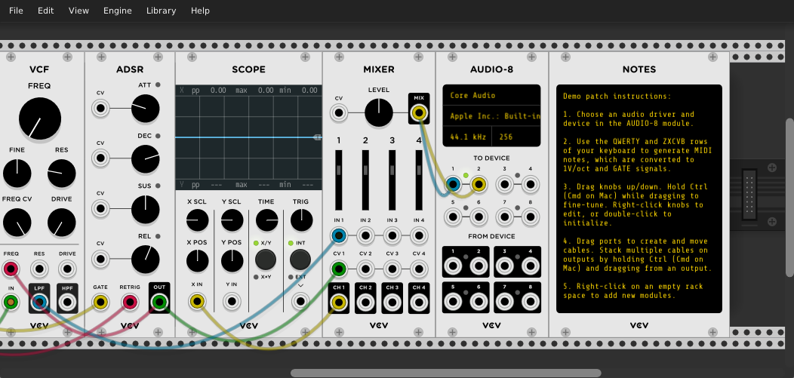

# Getting Started

VCV Rack is virtual modular synthesizer platform for Windows/Mac/Linux that simulates Eurorack modules, in addition to original modules that go beyond hardware.

Once [VCV Rack](https://vcvrack.com/Rack) is installed and launched for the first time (see [Installing](Installing.html)), you will see a rack with a template patch.

The [*VCV Audio*](Core.html#audio) module is the portal between the virtual and physical world.
It sends audio from VCV Rack to your speakers and audio device (e.g. sound card or external audio interface).
It can also receive audio from microphones and your audio device's inputs.

1\. To set up *VCV Audio*, click its display to set the audio driver, device, and optionally sample rate and block size.

[*VCV MIDI-CV*](Core.html#midi-cv) converts MIDI notes from a MIDI device (such as a keyboard or controller) to virtual voltages in Rack.
It can also use your computer's keyboard as a basic MIDI keyboard.

2\. Use the QWERTY and ZXCVB rows of your keyboard to generate MIDI notes, which are converted to 1V/oct and gate signals.

You can interact with knobs, sliders, and buttons on modules with your mouse.

3\. Drag knobs up/down to rotate. Hold Ctrl (Cmd on Mac) while dragging to fine-tune. Right-click knobs to edit, and double-click to initialize.
Try changing the frequency of [*VCV VCO-1*](https://library.vcvrack.com/Fundamental/VCO) by adjusting its FREQ knob while playing notes.

All signals in VCV Rack are virtual voltages, but they can classified roughly into a few categories:

- **Audio** signals are audible if played through your speakers. They contain *audio-rate* frequencies typically between 20Hz to 20kHz.
- **CV** (control voltage) signals can modulate parameters of other modules. For example, an LFO (low-frequency oscillator) can oscillate the pitch of a VCO (voltage-controlled oscillator) or the volume level of a VCA (voltage-controlled oscillator).
- **1V/oct** (1 volt per octave) signals are CV signals that represent a pitch or note. In this standard, an increase of 1V increases the pitch by 1 octave. Since there are 12 semitones in an octave, an increase of 1/12 V increases the pitch by 1 semitone.
- **Gate** signals carry an on/off signal. 0V represents off, and a positive voltage (typically 10V) represents on. For example, a gate signal can turn on when a key is pressed and off when the key is released.
- **Trigger** signals are short gates (usually around 1 millisecond) that cause an event to occur, such as a percussion hit.
- **Clock** signals are triggers played at a steady tempo, in order to set the musical timing of your patch.

Signals can be connected from module to module via patch cables, and you can even send a signal types for interesting results.

4\. Drag from port to port to create a cable. Move or delete an existing cable by dragging one of its plugs. Stack multiple cables on outputs by holding Ctrl (Cmd on Mac) and dragging from an output.

With VCV Rack, you can build and configure your ideal modular synthesizer rack.
VCV Rack includes several built-in modules, and you can expand your module collection by installing more online.

5\. Drag a module to move it around the rack. Right-click a module to open its context menu. Right-click on an empty rack space to launch the Module Browser to add new modules.

If you are new to modular synthesizers, we recommend that you learn how to use most of the modules included with VCV Rack and push them to their limits before installing other VCV or third-party modules.
The included modules are more capable than they might appear, and learning them in depth will give you more power and understanding when learning more modules later.
When you are ready, browse for more modules on the [VCV Library](https://library.vcvrack.com/).
