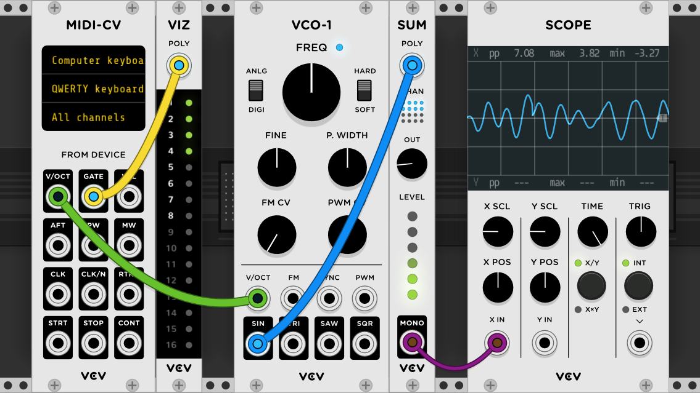
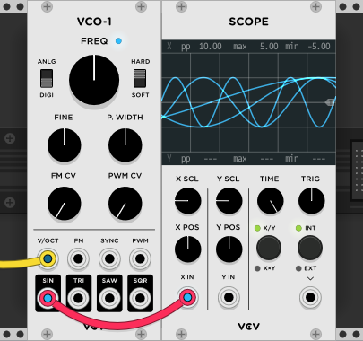

# Polyphony

*VCV Rack* supports polyphonic cables containing up to 16 channels of voltage (audio, CV, gates, etc).
To distinguish them from normal monophonic cables, polyphonic cables appear thicker and can contain any number of channels from 2 to 16.

Without polyphonic cables, patching a polyphonic synth would be very cumbersome, with increasing difficulty the more voices you need to support.
To allow a maximum of \\(N\\) voices to be played, you would need to create \\(N\\) identical VCOs, VCFs, VCAs, etc. with \\(N\\) sets of cables patched between them and then unity-mix their \\(N\\) outputs into a single signal.
But with polyphonic cables, you only need to patch one set of modules and then configure a single "source" module to generate a polyphonic output.

## Example

In the screenshot below, [*MIDI-CV*](Core.html#midi-cv) is configured to generate 8 channels by right-clicking on its panel, choosing a number of "Polyphonic channels", and optionally choosing a "Polyphony mode" to specify how MIDI notes are assigned to polyphonic channels.
Its V/OCT and GATE ports then become polyphonic outputs, and their signals can be sent to other polyphonic modules, carried by polyphonic cables.

Modules must be explicitly developed to support polyphony in order to handle polyphonic cables.
These modules are identified with the ["Polyphonic"](https://library.vcvrack.com/?query=&brand=&tag=Polyphonic&license=) tag.

Some modules generate polyphonic signals only when they are configured by the user, such as *MIDI-CV* explained above.
Other modules generate polyphonic outputs when a polyphonic cable is patched into one of its inputs.
In this example, *VCO-1* generates a polyphonic audio signal at its SINE output because a polyphonic pitch signal from *MIDI-CV's* V/OCT output is patched to *VCO-1's* V/OCT input.
This means that if you are careful to only use modules with the "Polyphonic" tag in your patch, you can enable polyphony across the entire patch by configuring a single module, e.g. *MIDI-CV*.
The rest of the modules turn polyphonic in a "chain reaction", starting from the polyphony source.

Useful utility modules for understanding and using polyphony in Rack include [VCV Split](https://library.vcvrack.com/Fundamental/Split) for splitting a polyphonic signal into multiple monophonic signals, [VCV Merge](https://library.vcvrack.com/Fundamental/Merge) for merging multiple monophonic signals into a polyphonic signal, [VCV Sum](https://library.vcvrack.com/Fundamental/Sum) for unity-mixing all channels in a polyphonic signal, and [VCV Viz](https://library.vcvrack.com/Fundamental/Viz) for visualizing the individual channels in a polyphonic signal.
Modules like [VCV Scope](https://library.vcvrack.com/Fundamental/Scope) can also be used for visualizing each channel separately.

## Technical details

In *Rack*, monophonic cables are actually just a special case of polyphonic cables, having just 1 channel.
This means there is only one type of cable in *Rack*: polyphonic.

Zero-channel cables are also possible, which make modules think the cable is unpatched.
This can be useful if a module has a particular unpatched behavior you want to use but don't want to actually unpatch the cable.
It is even possible for a hypothetical module to automate the number of channels of its outputs, in order to virtually patch/unpatch a cable according to a gate signal.
(Email contact@vcvrack.com if you know or made a module that does this.)

Modules that support polyphony almost always have better performance than using multiple copies of monophonic modules, often as high as 4x (25% the CPU).
This is because polyphonic modules are usually written with [SIMD instructions](https://en.wikipedia.org/wiki/SIMD), and/or take advantage of compiler auto-vectorization, which allows your CPU to process 4 channels (with [SSE](https://en.wikipedia.org/wiki/Streaming_SIMD_Extensions)) simultaneously on the same core.

## Other uses

Despite their name, polyphonic cables are not limited to making polyphonic synthesizer patches.
Other hypothetical uses include:
- stereo encoding using 2-channel polyphonic cables
- surround sound
- [ambisonics](https://en.wikipedia.org/wiki/Ambisonics). 3rd-order requires exactly 16 channels, making *Rack's* polyphonic cables a perfect medium for ambisonics signals.
- custom digital multi-channel bus protocols
- carrying signals at higher sample rates than *Rack's* engine is running. This could allow lower-CPU video synthesis.
- using [VCV Merge](https://library.vcvrack.com/Fundamental/Merge) and [VCV Split](https://library.vcvrack.com/Fundamental/Split) to "teleport" up to 16 monophonic signals to a different section of your patch to decrease cable clutter.
This concept is similar to the [Doepfer A-180-9 Multicore](http://www.doepfer.de/A1809.htm) Eurorack module, which (ab)uses RJ45 (Ethernet) cables to carry analog signals.
